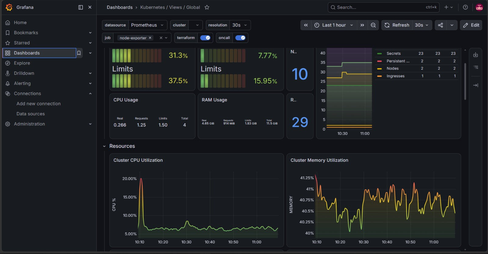
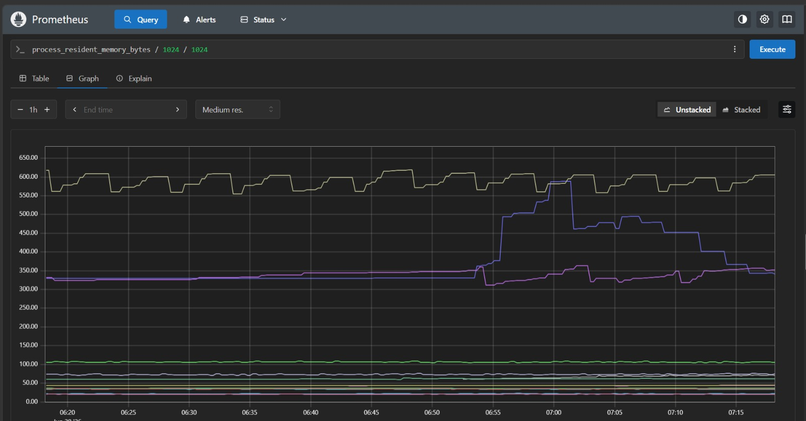
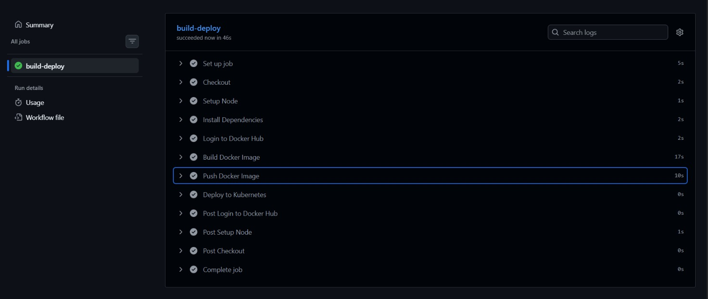

# Employee Management System on Kubernetes

A complete DevOps project demonstrating CI/CD, containerization, Kubernetes orchestration, monitoring, and application metrics.

#  Project Overview

This project is a complete DevOps implementation for deploying an Employee Management System.

The application is built using **Node.js** and **PostgreSQL**, containerized using **Docker**, automatically deployed using **GitHub Actions**, orchestrated by **Kubernetes**, and monitored using **Prometheus** and **Grafana**.

The application supports:

- Add Employee
- Update Employee
- Delete Employee
- Search Employees
- Upload Employee Images
    
#  Architecture

<p align="center">
    
</p>


### Architecture Overview


             Developer pushes code
                       ↓

             GitHub Actions builds Docker Image

                       ↓

             Image pushed to Docker Hub

                       ↓

             Kubernetes pulls latest image

                       ↓

             Application deployed

                       ↓

             Prometheus scrapes metrics

                       ↓

             Grafana visualizes metrics

## Features

- Employee CRUD Operations
- PostgreSQL Database
- Image Upload
- Docker Containerization
- GitHub Actions CI/CD
- Kubernetes Deployment
- Persistent Volumes
- Ingress NGINX
- Prometheus Monitoring
- Grafana Dashboards
- Application Metrics using prom-client

##  Tech Stack

| Category | Technology | Purpose |
|----------|------------|---------|
| Programming Language | JavaScript (Node.js) | Backend Development |
| Framework | Express.js | REST API Development |
| Database | PostgreSQL | Data Storage |
| Containerization | Docker | Package the application into containers |
| Container Registry | Docker Hub | Store and distribute Docker images |
| Version Control | Git | Source Code Management |
| Repository Hosting | GitHub | Host the project source code |
| CI/CD | GitHub Actions | Automated Build, Push, and Deployment |
| Container Orchestration | Kubernetes | Deploy and manage application containers |
| Networking | Calico | Kubernetes Container Network Interface (CNI) |
| Ingress Controller | NGINX Ingress | External access and HTTP routing |
| Storage | Persistent Volumes (PV) & Persistent Volume Claims (PVC) | Persistent application and database storage |
| Monitoring | Prometheus | Collect application and cluster metrics |
| Visualization | Grafana | Monitor and visualize metrics |
| Metrics Library | Prometheus Client (prom-client) | Expose custom application metrics |
| Operating System | Ubuntu 24.04 LTS | Master and Worker Nodes |
| Package Manager | npm | Manage Node.js dependencies |


##  Kubernetes Resources

| Resource | Name | Purpose |
|----------|------|---------|
| Namespace | `employee-app` | Isolates all project resources inside a dedicated namespace. |
| Deployment | `employee-app` | Deploys and manages multiple replicas of the Node.js application. |
| Deployment | `postgres` | Deploys the PostgreSQL database inside the cluster. |
| Service | `employee-service` | Exposes the Employee Application to other Kubernetes resources and external users through a NodePort. |
| Service | `postgres` | Provides internal communication between the application and PostgreSQL database. |
| Ingress | `employee-ingress` | Routes external HTTP requests to the Employee Application using NGINX Ingress Controller. |
| Persistent Volume (PV) | `uploads-pv` | Stores uploaded employee images permanently. |
| Persistent Volume Claim (PVC) | `uploads-pvc` | Claims storage for employee image uploads. |
| Persistent Volume (PV) | `postgres-pv` | Stores PostgreSQL database files persistently. |
| Persistent Volume Claim (PVC) | `postgres-pvc` | Claims persistent storage for PostgreSQL. |
| ServiceMonitor | `employee-app-monitor` | Enables Prometheus to scrape application metrics from the `/metrics` endpoint. |
| ConfigMap *(Optional)* | — | Not used in this project. |
| Secret | `postgres-secret` | Stores PostgreSQL credentials securely. |


---

#  Monitoring

The project is monitored using **Prometheus** and **Grafana** to provide real-time visibility into the Kubernetes cluster and the application.

## Monitoring Components

| Component | Description |
|-----------|-------------|
| **Prometheus** | Collects metrics from Kubernetes nodes, pods, and the Employee Management application through the `/metrics` endpoint. |
| **Grafana** | Visualizes metrics using interactive dashboards for cluster resources, application performance, and Node.js metrics. |
| **ServiceMonitor** | Automatically instructs Prometheus to scrape the Employee Management application's metrics. |

### Collected Metrics

- CPU Usage
- Memory Usage
- HTTP Requests
- Node.js Runtime Metrics
- Event Loop Latency
- Garbage Collection
- Kubernetes Node Metrics
- Pod Metrics

---

##  Grafana Dashboard

The Grafana dashboard provides a real-time overview of the Kubernetes cluster, including CPU usage, memory consumption, pod status, and application performance metrics.

<p align="center">
  
</p>

---

##  Prometheus Targets

Prometheus automatically discovers Kubernetes services and continuously scrapes metrics from the Employee Management application through the configured **ServiceMonitor**.

<p align="center">
  
</p>

## GitHub Actions Result

<p align="center">
    
</p>

#  Project Structure

```text
employee-management-devops/
│
├── .github/
│   └── workflows/
│       └── build-deploy.yml
│
├── config/
│   └── db.js
│
├── controllers/
│   └── employeeController.js
│
├── routes/
│   └── employeeRoutes.js
│
├── public/
│   ├── css/
│   ├── js/
│   ├── uploads/
│   └── index.html
│
├── docs/
│   ├── arch.png
│   ├── ci.jpg
│   ├── k8s-global.jpg
│   ├── node-exporter.jpg
│   └── pro.jpg
│
├── k8s/
│   ├── namespace.yaml
│   ├── app-deployment.yaml
│   ├── app-service.yaml
│   ├── postgres-deployment.yaml
│   ├── postgres-service.yaml
│   ├── ingress.yaml
│   ├── uploads-pv.yaml
│   ├── uploads-pvc.yaml
│   ├── postgres-pv.yaml
│   ├── postgres-pvc.yaml
│   ├── postgres-secret.yaml
│   └── servicemonitor.yaml
│
├── Dockerfile
├── docker-compose.yml
├── package.json
├── package-lock.json
├── server.js
├── init.sql
├── README.md
├── .dockerignore
└── .gitignore


## ‍ Authors

- Yousef Ebrahim Zakaria
- Salah Hamdi Ibrahim Omar
- Badr ElGendy
- Yousef Nabil Shahin
